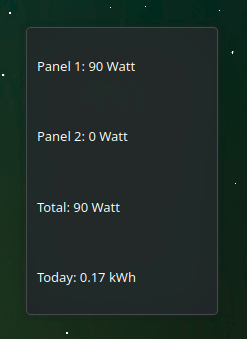

# EZMonitor

## Name
EZMonitor

## Description
EZMonitor is KDE Plasmoid to connect to a apsystems EZ1 Microinverter and show the power each solar panel is producing.

## Badges

## Visuals

## Installation
mkdir build && cd build

cmake ..

make

make install (as root)

## Usage
Add the Plasmoid to your Desktop and enjoy.

## Support
Open an issue in git ...

[EZMonitor Issues](https://www.opencode.net/agundur/ezmonitor/-/issues)

## Roadmap

## Contributing
accepting contributions ...

[EZMonitor](https://www.opencode.net/agundur/ezmonitor)

## Authors and acknowledgment
Alec

## License
GPL

## Project status
active
